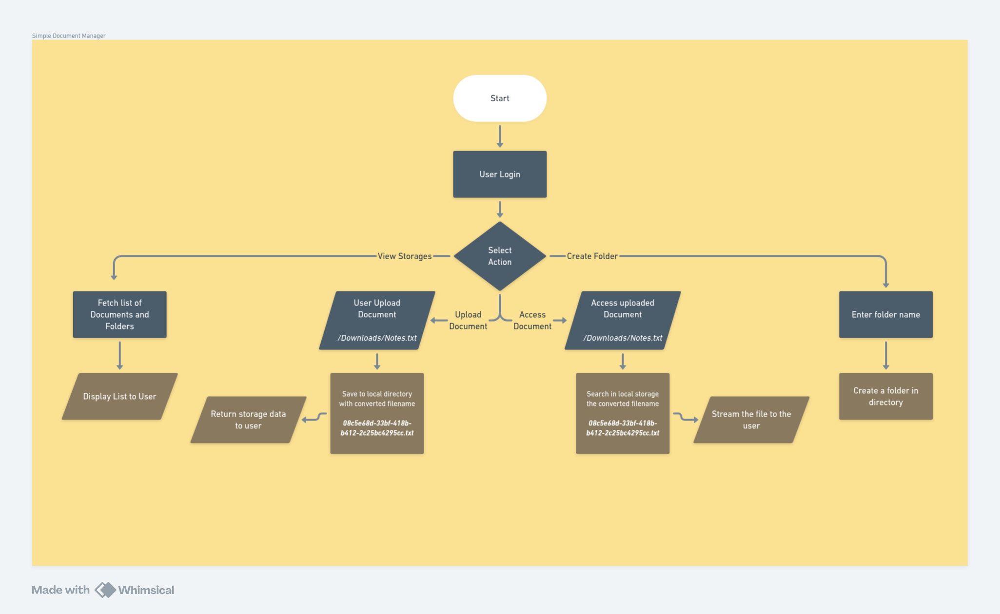
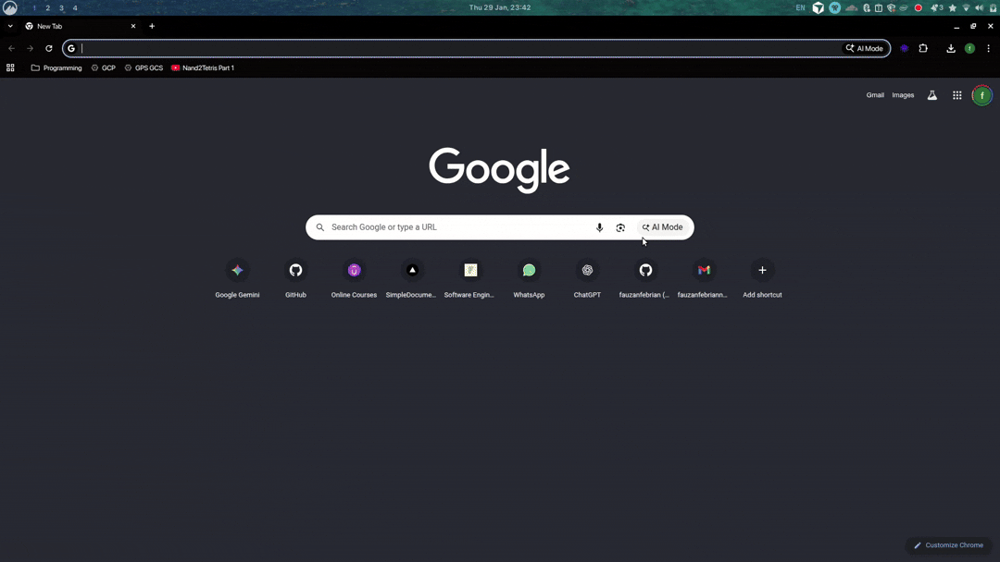

# Document Manager



A full-stack document and file management application with user authentication. Upload and organize files in folders, browse storage via a file-manager UI, and sign in with JWT-protected sessions.

- **Backend:** NestJS API with TypeORM and MySQL
- **Frontend:** Next.js app with Shadcn UI and Tailwind CSS

---

## Project Setup

Clone the repository and initialize submodules:

```bash
git clone https://github.com/SimpleDocumentManager/document-manager.git
cd document-manager
git submodule update --init --recursive
```

## Run Locally

### Docker Compose **(recommended)**

```bash
npm run compose
```

*alternate command*

```bash
docker compose -f docker-compose.yaml -p document-manager up --build
```

### Manual (npm workspaces)

Copy environment files, adjust as needed, then install, build, and start:

```bash
cp backend/.env.example backend/.env
cp frontend/.env.example frontend/.env

npm install
npm run build
npm start
```

> **Note:** For manual runs, ensure MySQL is available and `backend/.env` matches your database settings.

## Accessing the Application

| What      | Value                    |
| --------- | ------------------------ |
| Frontend  | http://localhost:3000    |
| Backend   | http://localhost:5000    |
| Username  | `admin`                  |
| Password  | `admin`                  |

---

## Demo

